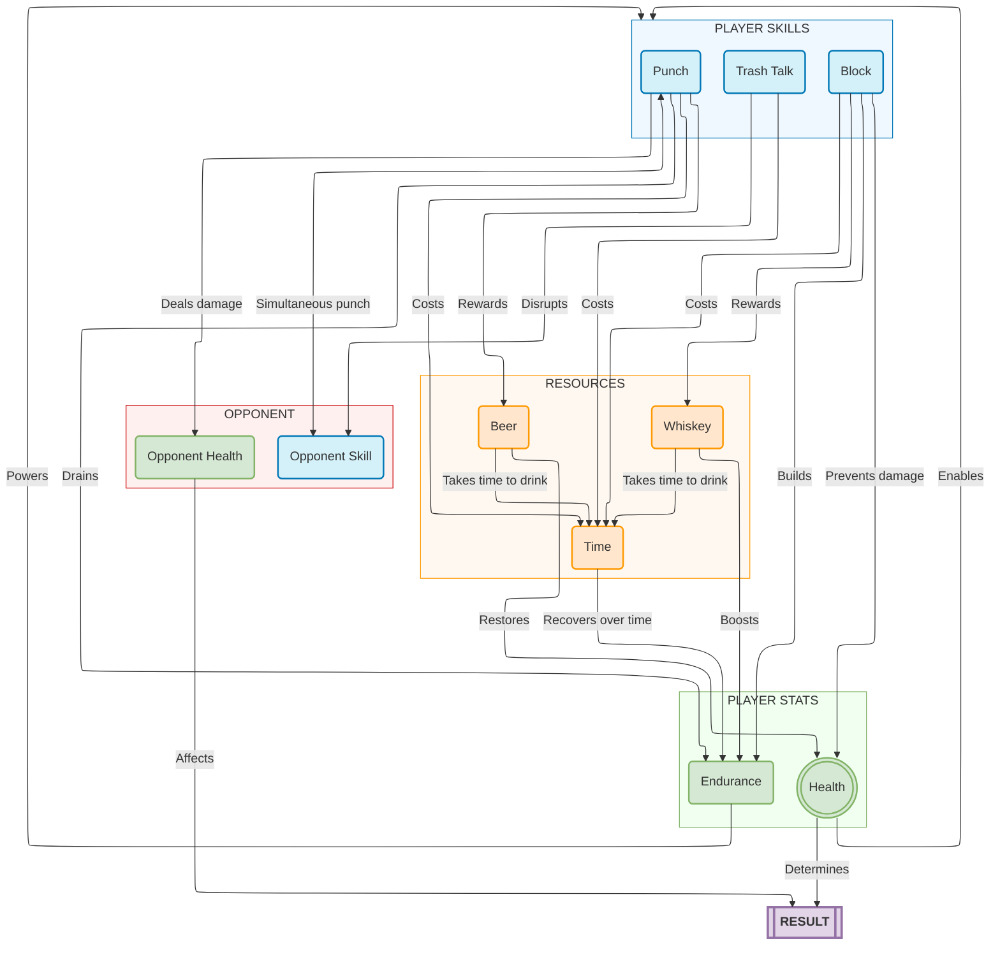

# Advanced Game Design Project Concept Demo
Ultimate Bar Championship

2D PvP Beat Em Up Game design concept demo for college project. Developed using Godot engine

Overview:
- **Player Skills**: Punch, Block, Trash Talk
- **Player Stats**: Health, Endurance
- **Resources**: Beer, Whiskey, Time
- **Opponent**: Opponent Skill, Opponent Health
- **Combat Mechanics**: Simultaneous punch, Skill effects on stats
- **Outcome**: Health, Opponent Health
- **Recovery Mechanics**: Time, Endurance
- **Stat effects on skills**: Health, Endurance
- **Resource relationships**: Beer, Whiskey
- **Time costs**: Punch, Block, Trash Talk

Resource Diagram

